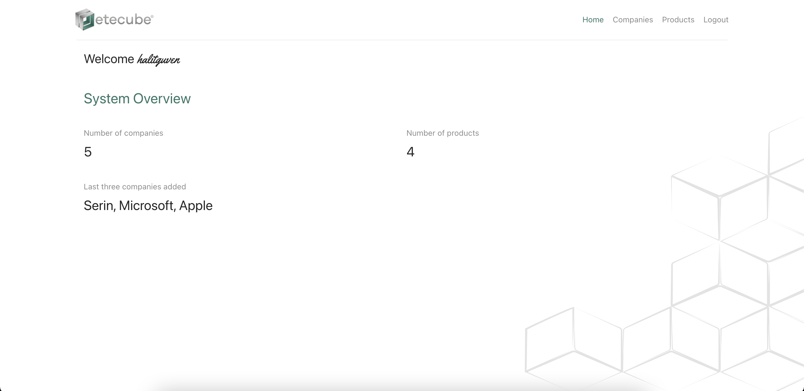

A records system using MongoDB, Express.js, React.js, and Node.js with real-time CRUD operations using Redux. REST API was implemented on the backend (for auth).

<div align="center">
    
</div>

### Prerequisites

- Node.js
- npm
- MongoDB

### Installation

Clone the repo

```sh
git clone https://github.com/haguse/etecube-mern
```

#### Frontend Installation (Port 3000)

```sh
cd client
npm i
npm run start
```

#### Backend Installation (Port 1337)

_Make sure MongoDB service is running._

```sh
cd server
npm i
npm run dev
```

#### Built with

- ReactJS
- Redux
- styled-components
- Ant Design
- MongoDB
- Express
- Node.js
